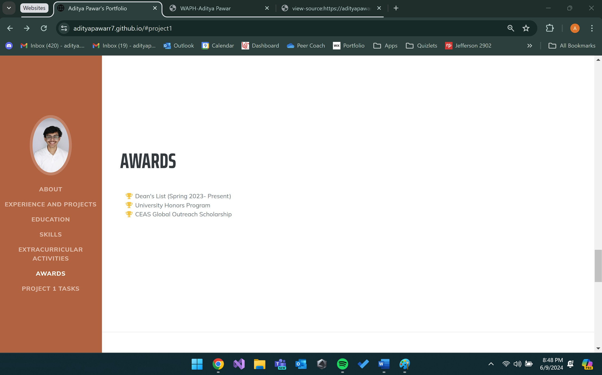
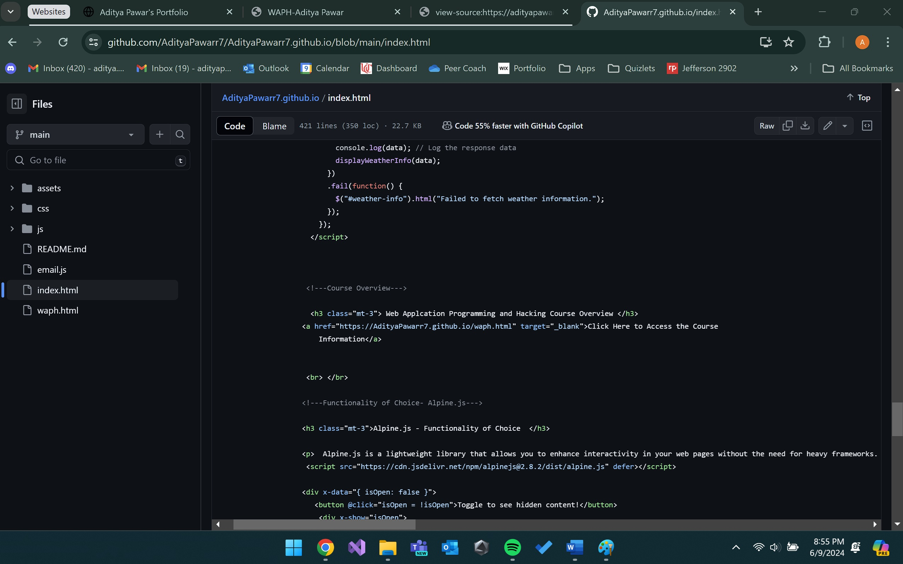
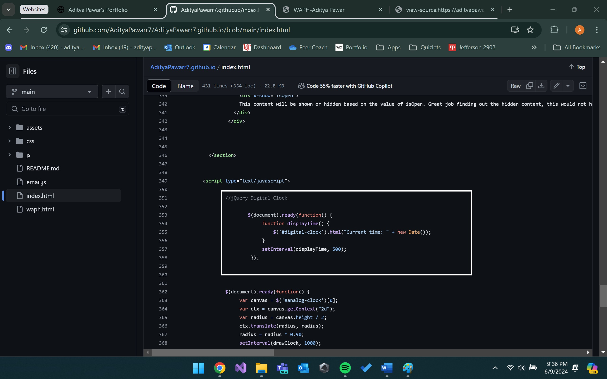
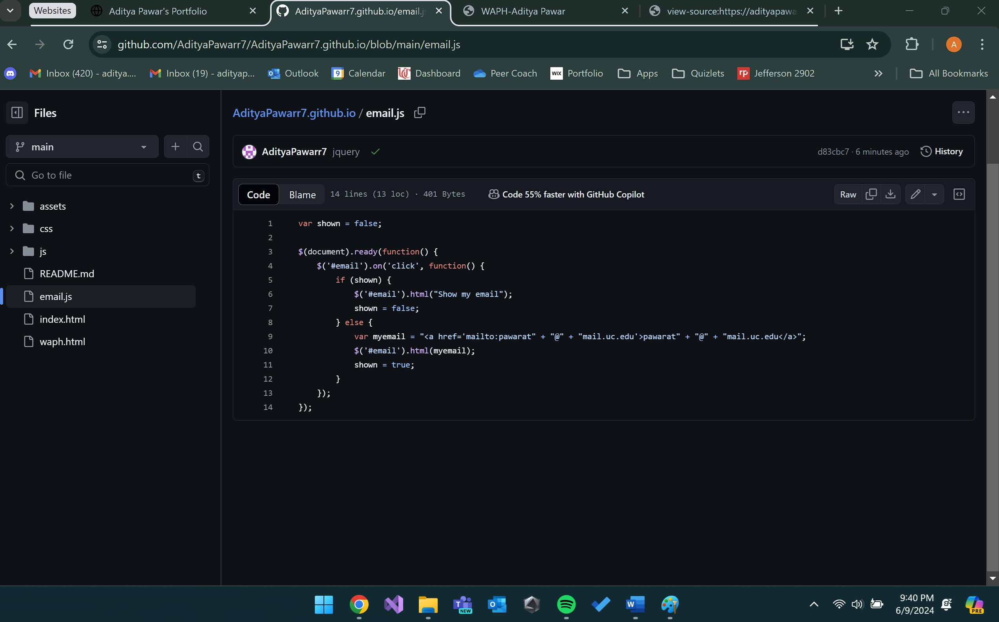

`## WAPH-Web Application Programming and Hacking

## Instructor: Dr. Phu Phung

## Student

**Name**: Aditya Pawar

**Email**: pawarat@mail.uc.edu

**Short-bio**: Aditya Pawar is a pre-junior majoring in Computer Science.


Last Update: 06/09/2024

## Repository Information

Respository's URL: [https://github.com/AdityaPawarr7/AdityaPawarr7.github.io](https://github.com/AdityaPawarr7/AdityaPawarr7.github.io)

This is a private repository for Aditya Pawar to store all code from the course. The organization of this repository is as follows.

# Individual Project 1

## Front-end Web Development with a Professional Profile Website on github.io cloud service

## Overview

For Individual Project 1 in front-end web development, I created and deployed a personal website on GitHub.io as a professional profile. This website includes my name, headshot, contact information, resume, background, education, experiences, and skills. Additionally, I added a new HTML page to introduce the "Web Application Programming and Hacking" course and related hands-on projects.
I used an open-source CSS template, specifically Bootstrap, to style my website, making it suitable for potential employers. To track page visits, I integrated Flag Counter. My website includes basic JavaScript features such as a digital clock, an analog clock, a show/hide email feature, and another functionality of my choice. I also integrated two public web APIs: the JokeAPI, which displays a new joke every minute, and WeatherAPI to show the weather in Cincinnati. Furthermore, I implemented JavaScript cookies to remember returning visitors. If it's their first visit, the website displays "Welcome to my homepage for the first time!" Otherwise, it shows "Welcome back! Your last visit was <the date/time of last visit>," with this value updating on each visit.

Through this project, I learned important skills in creating a personal portfolio, using Bootstrap for design, and using cookies to keep track of users. I also improved my ability to use JavaScript and public APIs, and in a way applying all the knowledge that we've learned in the lectures until now.

In this project, I expanded on front-end web development skills by developing a Professional Profile Website and deploying it on `github.io` cloud service. This project has general, non-technical, and technical requirements which are met as shown in the content below with screenshots.

### General requirements: 

+ Create and deploy a personal website on GitHub cloud (github.io) as a professional profile with your resume, including your name, headshot, contact information, background, e.g., education, your experiences and skills (25 pts).

 For this task, we followed the instructions as given in Lecture 6 slides and followed along with Professor Phung to create a new public repository named ```AdityaPawarr7.github.io``` in order to host our professional portfolio website. On top of that, I added in the experiences on my resume, my name, headshot, contact information, background, education, and skills as well.

The link for the webpage is [AdityaPawarr7.github.io](https://AdityaPawarr7.github.io)

The screenshots below show all the information that the requirements talk about.

\pagebreak

General Information Screenshot: 


\pagebreak

Experiences and Projects: 


\pagebreak

Education: 


\pagebreak

Skills: 


\pagebreak

Extracurriculars: 


\pagebreak

Awards: 



​
+ Create a link to a new HTML page to introduce this "Web Application Programming and Hacking" course and related hands-on projects

For this task, we have to link our html page ``` index.html ``` to ``` waph.html ``` which will have the course overview for our class of Web Application Programming and Hacking. The following screenshots contain the piece of code linking the two html files and what ``` waph.html ``` looks like

\pagebreak

Link to waph.html: 



\pagebreak

waph.html 1: 


\pagebreak

waph.html 2: 


\pagebreak

waph.html 3: 


 ​
### Non-technical requirements 

+ Use an open-source CSS template or framework such as Bootstrap​

Now, we have to style up Professional Portfolio, we make use of Bootstrap. In order to use Bootstrap, we look up free Bootstrap themes available, download one of them, unzip them and upload all of its contents to our GitHub Repository. For my case, I chose a theme from the following link [Start Bootstrap Resume Theme](https://startbootstrap.com/theme/resume), I downloaded the file, unzipped it, and uploaded all of its contents to our repository.

The repository contains folders for assets, css, js, and the index.html page which came along with the downloaded theme. We work on the index.html to suit our needs. The screenshots below contain a glimpse of the theme, you can also view the website itself. Along with this, I've also included a screenshot of the files in the respository to show what content came along with the zip file.


\pagebreak

Theme Screenshot: 


\pagebreak

Files Screenshot: (Pay attention to the contents within the white outlined box)


+ Include a page tracker, for example: [https://analytics](https://analytics.withgoogle.com/)](https://analytics.withgoogle.com/), [https://flagcounter.com/](https://flagcounter.com/).


Now we have to include a page tracker, we choose ``` flagcounter.com ``` for our purposes. For this, we generate link from it's website and integrate it as shown in the screenshots below. The first screenshot shows the code and the second one shows the flag counter in action.

\pagebreak

Flag Counter Code: 

``` HTML
<a href="http://s11.flagcounter.com/more/wPY"></a>
```


\pagebreak

Flag Counter UI: 


### Technical requirements

For all of the technical requirements, the implementation in ```index.html``` is in the Project 1 Tasks subsection at the very end.

#### Basic JavaScript code 

+ Use jQuery and one more open-source JavaScript framework/library​ to implement JavaScript code introduced in Lab 2, including a digital clock, an analog clock, show/hide your email, and one more functionality of your choice.

 For this we have use jQuery and one more open-source JavaScript library to implement a digital clock, analog clock, show/hide email, and one more functionality of our choice for which we chose Alpine.js

 In order to implement the digital clock, we write the code for the function displayTime() as in Lab 2 but in jQuery. The screenshots below shows the code and the UI implementation.

 \pagebreak

Digital Clock Code: 



 \pagebreak

Digital Clock Code: 


\pagebreak

Digital Clock UI: 


In order to implement the analog clock, we refer to the script given to us by the professor and we also change the code given in Lab 2 to be in jQuery for our purposes. The screenshots below show the code and the UI Implementation.

 \pagebreak

Analog Clock Code: 


 \pagebreak

Analog Clock Code: 


\pagebreak

Analog Clock UI: 


Now, to implement email show/hide function, we refer to our email.js file- the code for which has also been change to jQueery form- we sill refer it from the ``` email.js ``` file though. The screenshots below show the code and the UI Implementation

\pagebreak

email.js code: 



\pagebreak

email.js code implementation in index.html: 


\pagebreak

Email showHide UI Implementation (Before being Clicked): 


\pagebreak

Email showHide UI Implementation (After being Clicked): 


Finally, in order to implement a functionality of our choice- we implement Alpine.js- which is a lightweight library that allows you to enhance interactivity in your web pages without the need for heavy frameworks. We use it in our scenario as a toggle button to show hidden content to show its implementation. Screenshots below show its code in ```index.html``` and its UI Implementation.

\pagebreak

Alpine.js code: 


\pagebreak

Alpine.js UI Before being Toggled:


\pagebreak

Alpine.js UI After being Toggled:


+ Two public Web APIs integration:
 _Ensure you include a disclaimer stating that the public/third-party services generate the generated contents below and that you are not responsible._

Screenshot of the Disclaimer:

\pagebreak

Disclaimer Screenshot:


1. Integrate the jokeAPI ([https://v2.jokeapi.dev/joke/Any](https://v2.jokeapi.dev/joke/Any), similar to Lab 2.2.d.i) with `Any` category of joke to display a new joke in your page every 1 minute.


Now, we have to integrate jokeAPI similar to Lab 2 but with the 'Any' category to display a joke and refresh it every 1 minute. We write the function getJoke() and set the interval to 6000 which is in milliseconds which is equal to 1 minute. The screenshots below show the code of jokeAPI and the implementation in UI. I can confirm that the 1 minute refresh works.

\pagebreak

jokeAPI Code Screenshot:


\pagebreak

jokeAPI UI Screenshot:


3. Integrate a public API with graphics and display that graphic/image in your page. Examples: [https://xkcd.com/info.0.json](https://xkcd.com/info.0.json), [https://www.weatherbit.io](https://www.weatherbit.io).

Now, we integrate the WeatherAPI into our Personal Portfolio Website. We do this by firstly signing up on the API's website to get a master key and then code the function displayWeatherInfo() in jQuery. The screenshots below show the code of the function and it's implementation in the website to show weather for Cincinnati.

\pagebreak

WeatherAPI Code Screenshot:


\pagebreak

WeatherAPI UI Screenshot:


+ Use JavaScript cookies to remember the client (10 pts): If first-time visit, display the message "Welcome to my homepage for the first time!"; otherwise, display the message "Welcome back! Your last visit was <the date/time of last visit>" (ensure that you update this value <the date/time of last visit> each time the same user visits -2pts if missing).


For this, we use the code given to us in the lecture slides and add more functions in order for it to work with our webpage. This code manages user visit information using cookies. When the webpage loads, the displayWelcomeMessage function is called, which retrieves the "lastVisitDate" cookie using the getCookie function. If the cookie does not exist, indicating a first-time visit, it shows an alert welcoming the user for the first time. If the cookie exists, it shows an alert with the date of the user's last visit. It then updates the "lastVisitDate" cookie with the current date and time, set to expire in 365 days, using the setCookie function.

The following screenshots show the code of how the cookies are used, and its implementation on a new browser (Microsoft Edge) on which I have not opened my portfolio site yet and then showing what happens when I reload it.

\pagebreak

Cookie Code Screenshot:


\pagebreak

First Time visiting the Webpage Screenshot:


\pagebreak

Second Time visiting the Webpage Screenshot (Refreshing):


